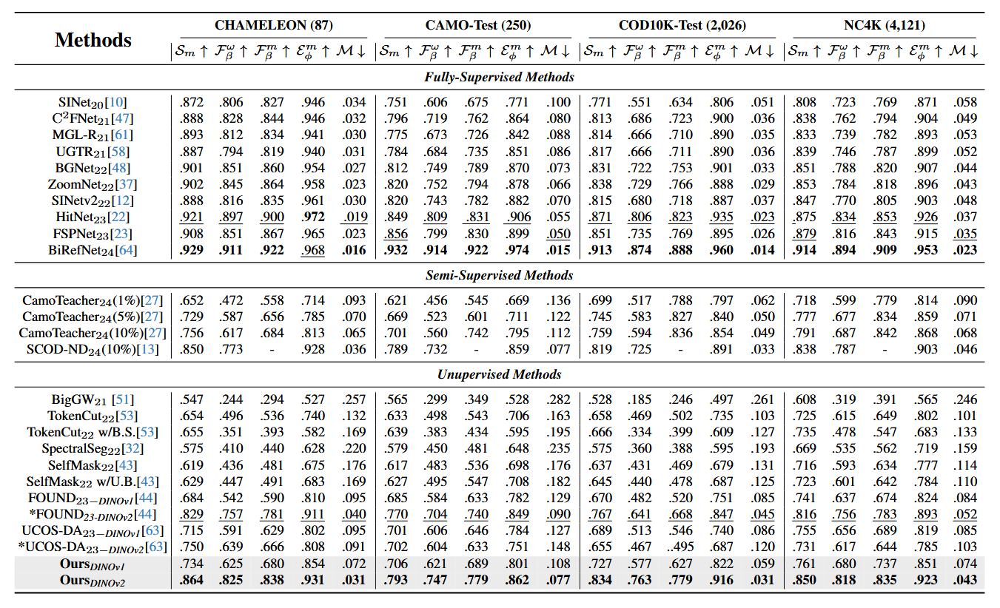

<div align="center">


<h1>Unsupervised Camouflaged Object Detection via Adaptive Pseudo-label Learning and Dynamic Local Refinement (CORAL)</h1>
<h1>UCOD-DPL: Unsupervised Camouflaged Object Detection  via Dynamic Pseudo-label Learning</h1>
<a href="https://openaccess.thecvf.com/content/CVPR2025/papers/Yan_UCOD-DPL_Unsupervised_Camouflaged_Object_Detection_via_Dynamic_Pseudo-label_Learning_CVPR_2025_paper.pdf" target="_blank" rel="noopener noreferrer"></a>
<a href="https://arxiv.org/abs/2506.07087"></a>
<a href="https://heartfirey.top/project_page/UCOD-DPL/"></a>

**[Key Laboratory of Multimedia Trusted Perception and Effecient Computing](https://multimedia.xmu.edu.cn)**

[Weiqi Yan](https://heartfirey.top), [Lvhai Chen](https://jormungand00222.github.io/Jormungand00222/), [Shengchuan Zhang](), [Yan Zhang](), [Liujuan Cao]()

</div>

## Updates

- [September 2, 2025] UCOD-DPL Code released. The full training code of `CORAL` will be released soon.
- [August 26, 2025] The extended work "Unsupervised Camouflaged Object Detection via Adaptive  Pseudo-label Learning and Dynamic Local Refinement (CORAL)" has been completed
- [April 5, 2025] The paper has been presented as a ✨highlight
- [February 27, 2025] The paper has been accepted by CVPR 2025 .

## Abstract
> Unsupervised Camoflaged Object Detection (UCOD) has gained attention since it doesn’t need to rely on extensive pixel-level labels. Existing UCOD methods typically generate pseudo-labels using fixed strategies and train 1 × 1 convolutional layers as a simple decoder, leading to low performance compared to fully-supervised methods. We emphasize two drawbacks in these approaches: 1). The model is prone to fitting incorrect knowledge due to the pseudolabel containing substantial noise. 2). The simple decoder fails to capture and learn the semantic features of camouflaged objects, especially for small-sized objects, due to the low-resolution pseudo-labels and severe confusion between foreground and background pixels. To this end, we propose a UCOD method with a teacher-student framework via Dynamic Pseudo-label Learning called UCOD-DPL, which contains an Adaptive Pseudo-label Module (APM), a Dual-Branch Adversarial (DBA) decoder, and a LookTwice mechanism. The APM module adaptively combines pseudo-labels generated by fixed strategies and the teacher model to prevent the model from overfitting incorrect knowledge while preserving the ability for self-correction; the DBA decoder takes adversarial learning of different segmentation objectives, guides the model to overcome the foreground-background confusion of camouflaged objects, and the Look-Twice mechanism mimics the human tendency to zoom in on camouflaged objects and performs secondary refinement on small-sized objects. Extensive experiments show that our method demonstrates outstanding performance, even surpassing some existing fully supervised methods.

## Quick Start
### Environment Setup

```
conda create -n coral python==3.9 -y && conda activate coral
pip install -r requirement.txt
```

### Dataset Preparation

Downloading dataset: [GoogleDrive](https://drive.google.com/drive/folders/19MaIVAcqr8sIv0R1hIq7MZhPqO-9_s8v?usp=drive_link) and moving it into `./datasets`.

Downloading pseudo labels from [GoogleDrive](https://drive.google.com/file/d/149Dh5OQnF1JBO2gzBkM4cj2jnJScRBys/view?usp=sharing) and moving it into `./datasets/cache/pseudo_label_cache`


### Training
The training stage for the first stage (UCOD-DPL):
```
# For UCOD-DPL using DINOv2 as backbone
bash ./scripts/launch_train_first_stage.sh -c ./configs/uscod/UCOD-DPL_dinov2.py

# For UCOD-DPL using DINOv1 as backbone
bash ./scripts/launch_train_first_stage.sh -c ./configs/uscod/UCOD-DPL_dinov1.py
```

**The training code of `CORAL` will be released  after the paper is published.**
### Evaluation
All checkpoints can be found in `./weights`.
```
# For UCOD-DPL using DINOv2 as backbone:
bash ./scripts/launch_val_first_stage.sh -c ./configs/uscod/UCOD-DPL_dinov2.py -m path/to/UCOD-DPL-dinov2/model
# For UCOD-DPL using DINOv1 as backbone:
bash ./scripts/launch_val_first_stage.sh -c ./configs/uscod/UCOD-DPL_dinov1.py -m path/to/UCOD-DPL-dinov1/model
```
Performance of UCOD-DPL


```
# For CORAL using DINOv2 as backbone:
bash ./scripts/launch_val_second_stage.sh -c ./configs/uscod/CORAL_dinov2.py -m path/to/UCOD-DPL-dinov2/model -r path/to/CORAL_dinov2/model
# For CORAL using DINOv1 as backbone:
bash ./scripts/launch_val_second_stage.sh -c ./configs/uscod/CORAL_dinov1.py -m path/to/UCOD-DPL-dinov1/model -r path/to/CORAL_dinov1/model
```
Performance of CORAL


## Acknowledgements
This work was supported by the National Science Fund for Distinguished Young Scholars (No.62025603), the National Natural Science Foundation of China (No. U21B2037, No. U22B2051, No. U23A20383, No. 62176222, No. 62176223, No. 62176226, No. 62072386, No. 62072387, No. 62072389, No. 62002305 and No. 62272401), and the Natural Science Foundation of Fujian Province of China (No. 2021J06003, No. 2022J06001).

## Reference
```bibtex
@inproceedings{yan2025ucod,
  title={UCOD-DPL: Unsupervised Camouflaged Object Detection via Dynamic Pseudo-label Learning},
  author={Yan, Weiqi and Chen, Lvhai and Kou, Huaijia and Zhang, Shengchuan and Zhang, Yan and Cao, Liujuan},
  booktitle={Proceedings of the Computer Vision and Pattern Recognition Conference},
  pages={30365--30375},
  year={2025}
}
```
